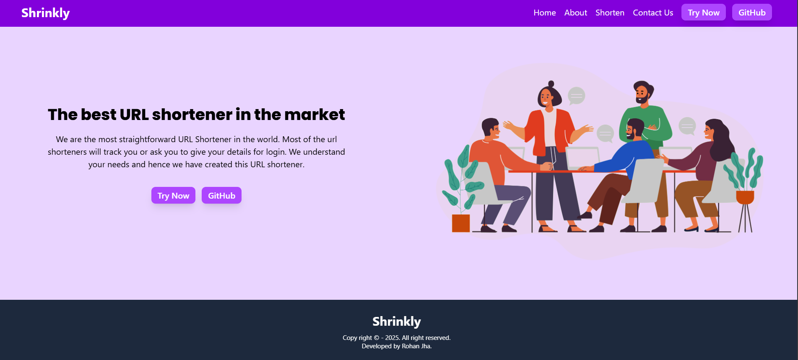

## 🔗 Shrinkly – URL Shortener

Shrinkly is a modern, fast, and privacy-focused URL shortener built using **React (Vite)**, **Express.js**, and **Tailwind CSS**. It allows users to generate short URLs instantly, with either custom aliases or auto-generated ones. It safely stores and dynamically redirects URLs using server-side routing, without requiring a login or tracking private user data.

## 📸 Screenshots

### 🖥️ App Interface

## ✨ Features

- 🔗 **Generate Short URLs Instantly:** Create short links with custom aliases or let the system auto-generate them.
- 🚀 **Server-Side Redirection:** Lightning-fast redirection handled seamlessly by the React router and Express.js backend.
- 🛡️ **URL Validation:** Backend checks prevent malicious or malformed links from being created.
- 🗄️ **MongoDB Storage:** Original and short URLs, along with click counts, are securely stored in a cloud MongoDB Atlas database.
- 🎨 **Modern & Responsive UI:** Clean interface styled with Tailwind CSS.
- 🔔 **Interactive Feedback:** Real-time success and error popups using `react-toastify`.
- 🔐 **No Authentication Required:** Simple and straightforward access for everyone.

## 🛠️ Tech Stack

### Frontend
- React.js (Vite)
- Tailwind CSS v4
- React Router DOM
- React Toastify

### Backend
- Node.js & Express.js
- MongoDB (Node.js Driver)
- MongoDB Atlas (Cloud Database)
- CORS & Dotenv

### Deployment Guide

Since this is a decoupled application (Monorepo), the frontend and backend are deployed separately but reside in the same repository.

#### 1. Database (MongoDB Atlas)
1. Create a free M0 Cluster on [MongoDB Atlas](https://www.mongodb.com/cloud/atlas/register).
2. Create a Database User with a password.
3. Allow Network Access from anywhere (`0.0.0.0/0`).
4. Copy the Node.js connection string and replace the password to get your `MONGODB_URI`.

#### 2. Backend (Render)
1. Push your entire repository to GitHub.
2. Go to [Render](https://render.com) and create a **New Web Service**.
3. Select your repository.
4. Set **Root Directory** to `backend`.
5. Set Build Command to `npm install` and Start Command to `node server.js`.
6. Add Environment Variable: `MONGODB_URI` (paste your Atlas string here).
7. Deploy and copy the provided live API URL.

#### 3. Frontend (Vercel)
1. Go to [Vercel](https://vercel.com) and Add New **Project**.
2. Import the same repository.
3. Click "Edit" on **Root Directory** and select `frontend`.
4. Framework Preset should auto-detect as **Vite**.
5. Add Environment Variable: `VITE_API_URL` (paste the live backend URL from Render here, without a trailing slash).
6. Deploy your application!

## 🔁 How URL Redirection Works

1. User submits a long URL with an optional preferred alias.
2. The API validates the URL and ensures the alias doesn't already exist.
3. The short URL and original URL are saved in MongoDB.
4. When the short URL is accessed (e.g., `shrinkly.vercel.app/alias`), the React frontend route `/:shorturl` intercepts the request and retrieves the long URL from the backend.
5. The server fetches the original URL and redirects the user automatically.

## 👨‍💻 Developer
Developed by: **Rohan Jha**
